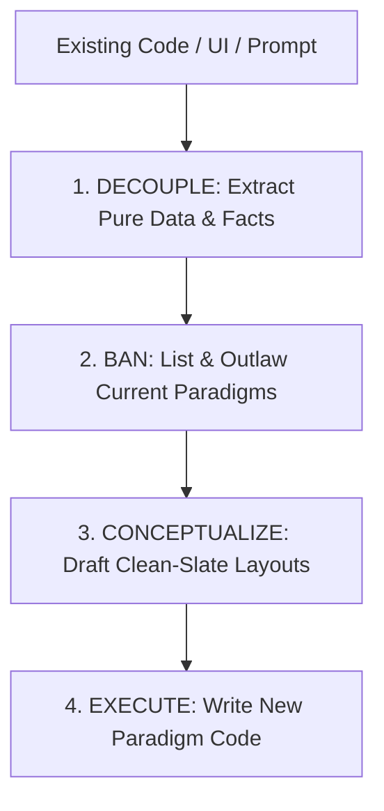

# Deanchor ⚓➡️🌌

An advanced agentic skill to break **contextual anchoring** (anchoring bias) in LLM-driven coding, design, and writing.

Like `ponytail` for simplicity, `deanchor` is a persistent mode and command suite designed to force AI agents (such as Antigravity, Claude Code, Codex, and Cursor) to escape "local maxima." It explicitly decouples the underlying data/facts from current presentation layers, bans legacy structural paradigms, and drafts new layout concepts before writing a single line of code.

---

## The Problem: Contextual Anchoring

When an AI coding agent is provided with existing code or UI structures, those tokens heavily weight the probability distribution of its subsequent outputs. The model is mathematically biased to optimize within the current structural paradigm—finding a **local maximum**—rather than executing a fundamental redesign from a blank slate.

This is a universal limitation across all current frontier models.

## The Solution: The Deanchor Protocol

`deanchor` enforces a strict, three-phase cognitive pipeline on the agent *before* any implementation begins:



1. **DECOUPLE (Data Extraction):** Strip away all styling, class names, file structures, and control flows. Extract *only* the raw facts, user intents, inputs, and outputs into a clean markdown schema.
2. **BAN (Structural Prohibition):** Identify the existing architectural and visual paradigms and place them on a strict "Banned list." The agent is legally forbidden from reusing these structures.
3. **CONCEPTUALIZE (Blank-Slate Design):** Design a completely new layout or software architecture from scratch using the decoupled data and respecting the banned list.
4. **EXECUTE (Implementation):** Implement the approved clean-slate design. No copying of old boilerplate.

---

## Command Suite

| Command | Focus | Auto-Activation Triggers |
| :--- | :--- | :--- |
| `/deanchor` | **General Redesign** | `deanchor`, `unanchor`, `blank slate`, `tabula rasa`, `anchoring bias` |
| `/deanchor-dev` | **Software Architecture** | `redesign architecture`, `rewrite codebase`, `restructure files`, `deanchor-dev` |
| `/deanchor-design` | **UI/UX & Layouts** | `redesign page`, `visual revamp`, `new layout`, `deanchor-design` |
| `/deanchor-doc` | **Documentation & Copy** | `rewrite docs`, `rewrite readmes`, `new voice`, `deanchor-doc` |
| `/deanchor-review` | **Anchoring Audit** | `review for anchoring`, `find anchored code`, `deanchor-review` |
| `/deanchor-help` | **Quick Reference** | `deanchor help`, `deanchor commands`, `/deanchor-help` |

---

## Intensity Levels

Change the intensity with `/deanchor [lite|full|ultra]` (Default: `full`):

*   **Lite:** Decouples data and identifies banned paradigms. Drafts **two** alternative concepts and pauses for user feedback before writing code.
*   **Full (Default):** The Deanchor Protocol strictly enforced. Decouples, bans, conceptualizes a single premium path, and writes the clean-slate code immediately.
*   **Ultra:** Radical redesign. Re-evaluates the core problem definition. Banishes all current tech stacks and frameworks. Proposes a minimal, alternative paradigm (e.g., replacing a React dashboard with a custom Canvas or a keyboard-driven CLI overlay).

---

## Installation

### Node.js CLI
Run the following commands from the project root:

1. **Install Workflows & Skills:**
   ```bash
   node bin/deanchor.js install
   ```

2. **Enable Git Pre-Commit Hook (Auto-Syncing):**
   ```bash
   node bin/deanchor.js init-hook
   ```

3. **Check Status:**
   ```bash
   node bin/deanchor.js status
   ```

This compiles templates (injecting custom banned paradigms and settings) and installs custom rules into your agent's global paths:
- **Antigravity Profiles:** `%USERPROFILE%\AntigravityProfiles\<profile>\.gemini\antigravity\global_workflows\`
- **Claude Code:** Project-specific `.clauderules` or configuration file instructions.
- **Cursor:** `.cursorrules` in your project root.

---

## Configuration

Configure the default mode in `~/.config/deanchor/config.json` (Windows: `%APPDATA%\deanchor\config.json`):

```json
{
  "defaultMode": "full",
  "ignoredPaths": [
    "node_modules",
    "dist",
    ".git"
  ],
  "customBannedParadigms": [
    "traditional-sidebar-dashboard",
    "use-effect-data-fetching"
  ]
}
```

---

## License

MIT - Break the anchor, explore the space.
